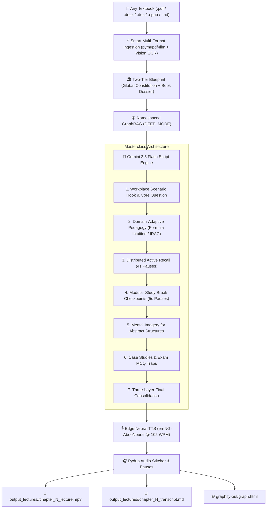

# 🎙️ book2Lecture

> **Universal AI-Powered Pedagogical Audio Masterclass & Knowledge Graph Engine**  
> Transform any academic textbook, professional study pack, or document (`.pdf`, `.docx`, `.doc`, `.epub`, `.md`, `.txt`) into engaging, unhurried, conversational audio masterclasses engineered for deep retention, spoken formula intuition, and examination excellence.

---

## 🌟 Overview

**book2Lecture** is a decoupled, multi-book pedagogical generation pipeline that bridges the gap between dense written textbooks and modern spoken audio learning. Unlike simplistic text-to-speech tools that read bullet points verbatim, `book2Lecture` **processes, unpacks, and explains** the material as an expert university professor or executive coach would.

The engine integrates:
* **Cognitive Load Theory & Pacing:** Calibrated at **100–110 WPM** using natural Nigerian English neural voices (`en-NG-AbeoNeural` / `en-NG-EzinneNeural`).
* **Two-Tier Pedagogical Architecture:** A Universal Global Constitution paired with automated, book-specific research blueprints.
* **Decoupled Local OCR Microservice:** A standalone FastAPI REST daemon (`services/ocr_service/`) with auto-spawning lifecycle, layout analysis, and Math/LaTeX formula transcription—**100% offline and zero cost**.
* **Zero-Shortcut Full-Book Ingestion:** Page-level atomic disk checkpointing (`.ocr_cache/page_XXXX.md`) ensuring large 600+ page books are verified and assembled end-to-end.
* **Distributed Retrieval Practice (Active Recall):** Micro-questions with 4-second reflection pauses throughout the lesson.
* **Modular Study Break Checkpoints:** 5-second verbal pauses inserted every 8–12 minutes to support cognitive chunking.
* **Automated Graphify Synchronization:** Real-time knowledge graph updates (`graph.html`) executed automatically after every chapter audio generation.

---

## 🚀 Core Features

### 1. 📂 Universal Multi-Format Document Ingestion & Decoupled OCR Microservice
Ingests and auto-caches any textbook format into structured GitHub Markdown:
* **Word Documents (`.docx`):** Converted via `mammoth` into semantic Markdown with tables, headers (`#`, `##`), and bullet hierarchies at **0 API tokens**.
* **Legacy Word (`.doc`):** Converted via headless LibreOffice into clean Markdown.
* **eBooks (`.epub`):** Extracted via `ebooklib` and `html2text` preserving chapter spines and formatting.
* **PDF Books (`.pdf`):** Processed via a **Hybrid Smart Ingestion Pipeline**:
  * *Digital Text Pages:* Converted locally in seconds via `pymupdf4llm` at **0 API tokens**.
  * *Scanned Photocopies & Complex Pages:* Routed to the **Decoupled FastAPI Local OCR Microservice** (`http://127.0.0.1:8088`), using RapidOCR and a Math-to-LaTeX transformer for offline transcription of formulas, fractions, and Greek symbols into `$LaTeX$` blocks with zero API costs.
  * *Cloud Fallback:* Optional targeted multimodal Gemini Vision OCR when an active API key is provided.
* **Plain Text & Markdown (`.md`, `.txt`):** Direct zero-overhead ingestion.

### 2. ⚡ Standalone FastAPI Local OCR Microservice (`services/ocr_service/`)
* **Decoupled Architecture:** Isolates heavy ML libraries (PyTorch, ONNX, OpenCV, RapidOCR) into an independent background service running on port `8088`.
* **Zero-Configuration Auto-Start:** `OCRServiceClient` detects whether the microservice is active and automatically spawns the background daemon on demand.
* **Math & LaTeX Preservation:** Formats complex statistical formulas ($\bar{x} = \frac{\sum fx}{\sum f}$, $\sigma = \sqrt{\frac{\sum f(x-\bar{x})^2}{\sum f}}$, $Z = \frac{X-\mu}{\sigma}$) into native LaTeX blocks (`$$ ... $$`).

### 3. 🏛️ Two-Tier Pedagogical Architecture
* **Tier 1 — The Global Constitution (`deep-research-report.md`):** Defines universal laws of audio learning science, working memory limits, pause durations, and synthesis layers.
* **Tier 2 — The Book-Specific Blueprint (`books/<slug>/deeper-research-report.md`):** An automated, deep cognitive research study generated for each book detailing discipline-specific hurdles (e.g. math anxiety), spoken translation rules, mental models, and prerequisite maps.

### 4. 🎯 4 Domain-Adaptive Spoken Modalities
The engine automatically adapts its spoken teaching technique depending on the academic field:
* 📊 **Modality A (Quantitative & Statistical):** **Spoken Formula Intuition**—explains the physical and conceptual logic of equations in plain words before computing; walks through step-by-step numerical examples.
* 👥 **Modality B (Conceptual & Strategic Management):** **Scenario-Driven Diagnostics**—opens with executive workplace conflicts, simulates organizational dialogue, and uses spoken geometric imagery (e.g. *The Three-Legged Stool of Enterprise*, *The Corporate Veil Seesaw*).
* ⚖️ **Modality C (Legal & Regulatory):** **IRAC Case Analysis**—structures legal principles around Issue, Rule, Application, and Conclusion with statutory interpretations (e.g. CAMA 2020).
* 🔬 **Modality D (Procedural & Methodological):** **Sequential Lifecycle Walkthroughs**—steps through operational research designs and sampling workflows.

### 5. 🕸️ Automated Post-Chapter Graphify Synchronization
* Automatically updates the Knowledge Graph (`graphify-out/graph.json`) and regenerates [`graphify-out/graph.html`](file:///home/itunz/Work/Joy_Lecture/graphify-out/graph.html) after **every single chapter** completes audio generation.
* Provides interactive 3D visual cluster graphs and audit reports in `graphify-out/GRAPH_REPORT.md`.

---

## 📁 Repository Structure

```text
book2Lecture/
├── books/                                     # Book Catalog directory (Ignored by git)
│   ├── .gitkeep
│   ├── sample_book/
│   │   └── book_config.example.json           # Template configuration
│   └── <book_slug>/                           # Local book folder
│       ├── book.pdf / book.docx / book.md     # Source textbook (Any format)
│       ├── .ocr_cache/                        # Atomic page-by-page OCR checkpoints
│       ├── book_config.json                   # Book metadata & voice settings
│       └── deeper-research-report.md          # Book-specific pedagogical blueprint
│
├── services/                                  # Decoupled Local Microservices
│   ├── ocr_service/                           # FastAPI OCR Microservice (Port 8088)
│   │   ├── app.py                             # REST Endpoints (/health, /ocr/page)
│   │   ├── pipeline.py                        # RapidOCR + Math/LaTeX Formatter
│   │   └── config.py                          # Service Configuration
│   └── ocr_client.py                          # Auto-spawning REST Client
│
├── output_lectures/                           # Scoped outputs per book (Ignored by git)
│   ├── .gitkeep
│   └── <book_slug>/
│       ├── chapter_1_lecture.mp3              # High-bitrate Masterclass Audio (100–110 WPM)
│       ├── chapter_1_transcript.md           # Synchronized Study Transcript
│       └── chapter_1_script.json             # Structured Masterclass Script
│
├── graphify-out/                              # Knowledge Graph Output (HTML & JSON)
│   ├── graph.html                             # Interactive in-browser Knowledge Graph
│   ├── graph.json                             # GraphRAG-ready JSON database
│   └── GRAPH_REPORT.md                        # Structural Analysis & Community Report
│
├── lecture_generator.py                       # Universal Multi-Book CLI Engine
├── deep-research-report.md                    # Universal Global Pedagogical Constitution
├── requirements.txt                           # Python Dependencies
├── .gitignore                                 # Strict Book & Media Exclusion Rules
└── README.md                                  # Documentation
```

---

## 🔒 Content & Copyright Privacy Notice

> [!IMPORTANT]
> **Source Exclusion Policy:**  
> This repository contains only open-source engine code and architectural standards.
> Proprietary examination textbooks (`*.pdf`, `*.docx`, `*.epub`, `*.md`), copyright-protected study packs, and heavy binary audio files (`*.mp3`) are **strictly excluded from git commits** via `.gitignore`.
> Users must provide their own licensed study texts locally in the `books/` directory.

---

## 🛠️ Installation & Setup

### 1. System Requirements
* **Python 3.10+**
* **ffmpeg** (for audio assembly):
  ```bash
  # Ubuntu / Debian
  sudo apt-get install ffmpeg libreoffice

  # macOS
  brew install ffmpeg libreoffice
  ```

### 2. Clone and Setup Environment
```bash
git clone git@github.com:babaolu/book2Lecture.git
cd book2Lecture

# Create virtual environment
python3 -m venv .venv
source .venv/bin/activate

# Install dependencies
pip install -r requirements.txt
```

### 3. Configure Gemini API Key
Export your Gemini API key in your shell environment (required for autonomous textbook parsing, deeper research blueprints, multimodal vision OCR, and knowledge graph extraction; optional only when synthesizing pre-existing `--script-file` JSONs):
```bash
export GEMINI_API_KEY="your-gemini-api-key-here"
```

---

## 📖 CLI Workflow Guide

### Step 1: Add Any Book to the Catalog
Create a folder under `books/` and drop your `.pdf`, `.docx`, `.doc`, `.epub`, or `.md` file inside:
```bash
mkdir -p books/business_statistics
cp ~/Downloads/business_statistics.pdf books/business_statistics/book.pdf
```

*(Optional)* Create `books/business_statistics/book_config.json`:
```json
{
  "book_title": "Business Statistics and Social Research Methods (Intermediate I)",
  "short_slug": "business_statistics",
  "exam_body": "Chartered Institute of Personnel Management (CIPM)",
  "target_audience": "Intermediate I Examination Candidates",
  "default_voice": "en-NG-AbeoNeural",
  "default_rate": "-18%"
}
```

---

### Step 2: Run Automated Book Research & Deep Knowledge Graph Indexing

Run the automated deeper research study on the new book:
```bash
python lecture_generator.py --book business_statistics --research-book
```
This command automatically:
1. Conducts an exhaustive pedagogical study and saves `books/business_statistics/deeper-research-report.md`.
2. Runs a **`--mode deep` Graphify extraction** across all chapters.
3. Clusters communities and regenerates `graphify-out/graph.html`.

---

### Step 3: Inspect Books & Chapters

```bash
# List all registered books in catalog
python lecture_generator.py --list-books

# Auto-detect and list all chapters & word counts in a book
python lecture_generator.py --book business_statistics --list-chapters
```

---

### Step 4: Generate Audio Masterclasses

```bash
# Generate Chapter 1 with default Nigerian voice (en-NG-AbeoNeural) at 100–110 WPM
python lecture_generator.py --book business_statistics --chapter 1

# Generate with female Nigerian voice (en-NG-EzinneNeural)
python lecture_generator.py --book business_statistics --chapter 1 --voice en-NG-EzinneNeural

# Batch generate ALL chapters in the book sequentially
python lecture_generator.py --book business_statistics --all-chapters
```

---

### Step 5: Knowledge Graph Management

```bash
# Explicitly index a book into the Knowledge Graph (DEEP_MODE)
python lecture_generator.py --book business_statistics --index-book

# Re-cluster communities and re-export graph.html
python lecture_generator.py --sync-graph
```

Open `graphify-out/graph.html` directly in any web browser to explore your multi-book knowledge graph.

---

## 🎙️ Speech Customization Options

| Parameter | Options | Description |
| :--- | :--- | :--- |
| `--model` | `gemini-2.5-flash` (Default)<br>`gemini-3.7-flash`<br>`gemini-2.5-pro` | Gemini model used for script and pedagogical reasoning (or `GEMINI_MODEL` env var). |
| `--voice` | `en-NG-AbeoNeural` (Male default)<br>`en-NG-EzinneNeural` (Female)<br>`en-US-GuyNeural`<br>`en-GB-RyanNeural` | Neural voice selection across accents. |
| `--rate` | `-18%` (100–110 WPM default)<br>`-15%` (~109 WPM)<br>`+0%` (~130 WPM) | Fine-grained delivery speed adjustment. |
| `--engine` | `edge` (Default free neural TTS)<br>`gemini` (Gemini native TTS) | TTS backend provider. |

---

## 📊 Pedagogical Flow Diagram



---

## 📜 License
MIT License. Created for students, educators, and lifelong learners worldwide.
