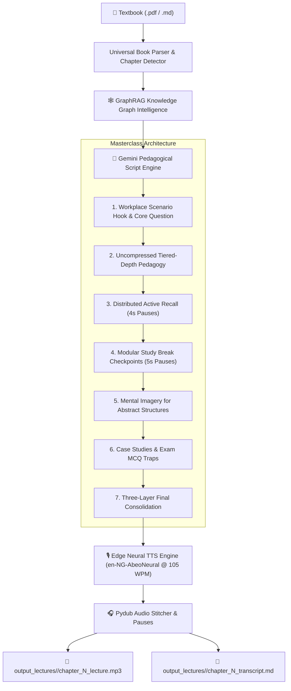

# 🎙️ book2Lecture

> **Universal AI-Powered Pedagogical Audio Masterclass Engine**  
> Transform any academic textbook or professional study pack (`.pdf`, `.md`, `.txt`) into engaging, unhurried, conversational audio masterclasses engineered for long-term memory retention and exam excellence.

---

## 🌟 Overview

**book2Lecture** is a decoupled, multi-book pedagogical generation pipeline that bridges the gap between dense written study packs and modern spoken audio learning. Unlike simple text-to-speech converters that read dry bullet points verbatim, `book2Lecture` **processes, unpacks, and explains** the material as an expert lecturer would.

It incorporates **Cognitive Load Theory**, **Distributed Retrieval Practice (Active Recall)**, **GraphRAG Knowledge Graph Retrieval**, and **Calibrated Neural Speech Synthesis** (calibrated at **100–110 WPM** with natural Nigerian English neural voices).

---

## 🚀 Core Features

* 📚 **Universal Multi-Book Support:** Process any book in `.pdf`, `.md`, or `.txt` format without modifying source code.
* 🧠 **Uncompressed Masterclass Architecture:**
  * No artificial 10-minute truncations; concepts are given the full unhurried depth they require (25–45 mins per chapter).
  * **Tiered-Depth Pedagogy:** Deep, scenario-driven explanations for complex concepts; structured, efficient compression for straightforward lists.
* ☕ **Modular Study Break Checkpoints:** Natural 5-second verbal pause invitations embedded every 8–10 minutes allowing learners to pause, review notes, or continue seamlessly.
* ⚡ **Distributed Active Recall:** Interactive retrieval questions interspersed throughout every major section, followed by 4-second reflection pauses before revealing model answers.
* 🇳🇬 **Calibrated Nigerian Neural TTS:** Powered by Edge Neural Speech (`en-NG-AbeoNeural` / `en-NG-EzinneNeural`) tuned to **100–110 WPM** (`rate=-18%`) for optimal academic comprehension.
* 🕸️ **GraphRAG Knowledge Graph Integration:** Queries the `graphify` knowledge graph for syllabus entities, cross-chapter prerequisites, and forward signposting.
* 📝 **Synchronized Study Transcripts:** Exports high-yield markdown transcripts alongside every generated audio lecture.

---

## 📁 Repository Structure

```text
book2Lecture/
├── books/                                     # Book Catalog directory
│   ├── .gitkeep
│   ├── sample_book/
│   │   └── book_config.example.json           # Template metadata configuration
│   └── <your_book_slug>/                      # (Ignored by git for copyright)
│       ├── book.pdf (or book.md)
│       └── book_config.json
│
├── output_lectures/                           # Scoped outputs per book (Ignored by git)
│   ├── .gitkeep
│   └── <your_book_slug>/
│       ├── chapter_1_lecture.mp3              # High-bitrate Masterclass Audio
│       ├── chapter_1_transcript.md           # Formatted Study Guide
│       └── chapter_1_script.json             # Structured Pedagogical Script
│
├── lecture_generator.py                       # Universal Multi-Book CLI Engine
├── deep-research-report.md                    # Universal Masterclass Architecture Standard
├── requirements.txt                           # Python Dependencies
├── .gitignore                                 # Strict Book & Media Exclusion Rules
└── README.md                                  # Documentation
```

---

## 🔒 Content & Copyright Privacy Notice

> [!IMPORTANT]
> **Source Exclusion Policy:**
> This repository contains only the open-source generation engine and architectural standards.
> Proprietary examination textbooks (`*.pdf`, `*.md`), copyright-protected study packs, and heavy binary audio files (`*.mp3`) are **strictly excluded from git commits** via `.gitignore`.
> Users must provide their own licensed study texts in the `books/` directory locally.

---

## 🛠️ Installation & Setup

### 1. Prerequisites
* **Python 3.10+**
* **ffmpeg** (for audio assembly):
  ```bash
  # Ubuntu / Debian
  sudo apt-get install ffmpeg

  # macOS
  brew install ffmpeg
  ```

### 2. Clone and Setup Environment
```bash
git clone git@github.com:babaolu/book2Lecture.git
cd book2Lecture

# Create virtual environment
python3 -m venv .venv
source .venv/bin/activate

# Install dependencies
pip install -r requirements.txt
```

### 3. Set API Key (Optional for Gemini Script Generation)
```bash
export GEMINI_API_KEY="your-gemini-api-key-here"
```

---

## 📖 CLI Usage Guide

### 1. Add a New Book
Create a folder under `books/` and drop your `.pdf` or `.md` file inside:
```bash
mkdir -p books/strategic_management
cp ~/Downloads/strategic_management.pdf books/strategic_management/book.pdf
```

*(Optional)* Create `books/strategic_management/book_config.json`:
```json
{
  "book_title": "Strategic Human Resource Management",
  "short_slug": "strategic_management",
  "exam_body": "CIPM Advanced Level",
  "target_audience": "HR Practitioners & Examination Candidates",
  "default_voice": "en-NG-AbeoNeural",
  "default_rate": "-18%"
}
```

---

### 2. List Available Books & Chapters

```bash
# List all books in the catalog
python lecture_generator.py --list-books

# Auto-detect and list all chapters & word counts in a book
python lecture_generator.py --book strategic_management --list-chapters

# Or inspect any PDF file directly
python lecture_generator.py --book "/path/to/any_book.pdf" --list-chapters
```

---

### 3. Generate Audio Masterclasses

```bash
# Generate Chapter 1 with default Nigerian voice (en-NG-AbeoNeural) at 100–110 WPM
python lecture_generator.py --book strategic_management --chapter 1

# Generate with female Nigerian voice (en-NG-EzinneNeural)
python lecture_generator.py --book strategic_management --chapter 1 --voice en-NG-EzinneNeural

# Batch generate ALL chapters in the book sequentially
python lecture_generator.py --book strategic_management --all-chapters
```

---

### 4. Customizing Speech Rate & Voices

| Parameter | Options | Description |
| :--- | :--- | :--- |
| `--voice` | `en-NG-AbeoNeural` (Male default)<br>`en-NG-EzinneNeural` (Female)<br>`en-US-GuyNeural`<br>`en-GB-RyanNeural` | Neural voice selection across accents. |
| `--rate` | `-18%` (100–110 WPM default)<br>`-15%` (~109 WPM)<br>`+0%` (~130 WPM) | Fine-grained delivery speed adjustment. |
| `--engine` | `edge` (Default free neural TTS)<br>`gemini` (Gemini native TTS) | TTS backend provider. |

---

## 📊 Pedagogical Flow



---

## 📜 License
MIT License. Created for students, educators, and lifelong learners worldwide.
