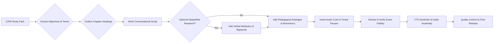

# Universal Pedagogical Architecture: Spoken Masterclasses for Professional Textbooks

## Executive Summary  
This report provides a universal, research-backed framework for converting academic textbooks and professional study packs (`.pdf`, `.md`, `.txt`) into **engaging, conversational, unhurried audio masterclasses**. It serves as the **Global Pedagogical Constitution** for the `book2Lecture` engine. It establishes the active target textbook—resolved dynamically per book—as the primary source of truth.

It details how to extract learning objectives, apply cognitive load theory to spoken audio, calibrate speech delivery (100–110 WPM with natural accents), embed distributed active recall with reflection pauses, insert modular study break checkpoints, and adapt spoken teaching techniques across diverse academic disciplines (quantitative statistics, conceptual management, legal statutes, and procedural workflows).

## The Two-Tier Pedagogical Architecture
The system operates on a dual-layer intelligence structure:
1. **The Global Constitution (`deep-research-report.md`):** Universal laws of audio learning science, working memory pacing, distributed retrieval practice, and synthesis layers that apply to every book.
2. **The Book-Specific Blueprint (`books/<slug>/deeper-research-report.md`):** A specialized deep research dossier generated for each specific textbook, detailing subject-specific cognitive hurdles (e.g., math anxiety), spoken formula translation rules, case precedent frameworks, and curriculum prerequisite maps.

## Core Directives: Source Fidelity, Depth & Audio-Masterclass Architecture
All scripting and speech synthesis must adhere to these seven immutable core directives:

1. **Active Textbook as the Primary Source of Truth:**
   - The primary source of truth is the active target textbook loaded from `books/<slug>/` (defined in `book_config.json`).
   - Scripts must strictly mirror the target textbook’s chapter sequence, section headings, specialized definitions, exam justifications, and syllabus terminology.
   - Maintain the required level of detail so candidates are fully prepared for exam-style questions, case studies, and multiple-choice questions (MCQs).

2. **Process and Explain Deeply, Never Merely Summarize:**
   - Do not simply read the textbook verbatim or reduce rich explanations into dry, brief bullet summaries.
   - **Tiered Depth Rule:** Explain difficult or examinable concepts deeply with concrete workplace scenarios and why-it-works logic. Compress straightforward lists efficiently without omitting any syllabus terms.
   - Never omit examinable categories, formulas, or classifications.

3. **Uncompressed Duration & Modular Study Break Architecture:**
   - Do not artificially compress or rush a chapter to fit an arbitrary 10–13 minute window if doing so strips out syllabus depth.
   - A thorough, comprehensive chapter lecture may run **15 to 45 minutes** as dictated by subject complexity.
   - To prevent listener fatigue and support cognitive chunking, embed **Modular Study Break Checkpoints** (2 to 3 per long lecture). At each checkpoint, provide a natural transition inviting the listener to pause, review notes, or continue:
     > *"Take a quick breath here. If you want to pause your audio and review your notes on these core principles, this is Study Checkpoint 1. Whenever you're ready, let's continue with Section X..."*

4. **Distributed Active Recall Throughout:**
   - Do not bunch all questions at the end. Intersperse retrieval practice throughout the entire lesson:
     > **Concept $\to$ Nuance & Scenario $\to$ Active Recall Question $\to$ 4-Second Reflection Pause $\to$ Answer & Takeaway $\to$ Continue.**

5. **Calibrated Spoken Delivery (100–110 WPM):**
   - Spoken audio must be calibrated to **100–110 Words Per Minute** using natural, clear neural voices (`en-NG-AbeoNeural` / `en-NG-EzinneNeural`), ensuring optimal acoustic assimilation for complex academic material.

6. **Domain-Adaptive Teaching Modalities:**
   - The engine automatically activates specialized spoken techniques based on the subject matter:
     - **Modality A (Quantitative & Statistical):** *Spoken Formula Intuition*—explain the conceptual logic of mathematical equations in plain words before computing; walk through simple numerical examples step by step.
     - **Modality B (Conceptual & Management):** *Scenario-Driven Diagnostics*—open with workplace conflicts, simulate organizational dialogues, and use spoken geometric imagery for networks and organograms.
     - **Modality C (Legal & Regulatory):** *IRAC Case Law & Statutory Analysis*—structure legal principles around Issue, Rule, Application, and Conclusion.
     - **Modality D (Procedural & Methodological):** *Sequential Lifecycle Walkthroughs*—step through operational research protocols and workflows.

7. **Three-Layer Final Consolidation:**
   - **Layer 1:** Rapid chapter synthesis.
   - **Layer 2:** High-yield exam distinctions and traps (*"Don't confuse X with Y"*).
   - **Layer 3:** Active-recall self-test challenges and a forward bridge into the next chapter.

## Learning Objectives Extraction  
Begin by identifying each chapter’s **core objectives** and key terms. In study guides these often appear explicitly (e.g. CIPM chapters list “Learning Objectives” at the start). Use these objectives to frame your lecture: state them up front and revisit them. For instance, paraphrase objectives as goals (“By the end of this session you’ll be able to…”) to **orient the listener**.  Mark these points in the script so they can be emphasized verbally. Also extract headings/subheadings to form your outline.  Keep the objectives in mind when pacing: don’t overload one segment with too many distinct goals, which would overwhelm working memory.

## Conversational Scripting Techniques  
Adopt an **engaging, spoken style** rather than formal prose. Write as if talking to a friend.  Use **contractions** (“you’re” vs “you are”) and the second person (“you,” “we”) to sound natural. Begin sentences with the key idea to hook attention (e.g., “This is the key fact…”).  Include **rhetorical questions** and direct questions to the listener (e.g. “Have you ever…?”, “What do you think happens when…?”) to encourage mental engagement. 

Incorporate **stories and analogies** frequently. Tell a brief anecdote or real-world scenario to illustrate a point (cf. storytelling makes concepts 20× more memorable). For example, compare an abstract concept to a familiar situation (“Think of teamwork like a sports team: each person has a role, and coordination leads to success”).  Analogies connect new ideas to known ones, anchoring memory and comprehension. Use vivid details and varied tone (enthusiasm, pauses) to keep it lively. 

**Signpost transitions** clearly: say things like “Now that we’ve covered X, let’s move on to Y,” or “First we’ll discuss…, then we’ll examine…”. This verbal signposting helps listeners follow the structure. Employ **emphasis cues** by pausing or changing voice pitch on important words. (In a written script, one might mark `*emphasized*` words or use SSML `<emphasis>` tags for TTS.) Also **vary tone and pacing**: slow down and pause slightly before major points or questions, and speed up a bit during energetic examples.

## Microstructure: Language & Memory Aids  
**Keep sentences and vocabulary simple.** For audio, shorter sentences (5–15 words) and common words are easiest to follow. Complex or long sentences overload working memory. Minimize jargon; if a term is needed, define it conversationally (“This is called ‘X,’ which basically means…”).  Transition words (“however,” “next,” “for example”) and recaps (“In other words…”) guide listeners through the logic.

Embed **summaries and previews** at appropriate points. For instance, after a section say “In summary, the three main causes are…,” and before a new section say “Next we’ll discuss…”.  These mini-reviews reinforce structure. At the end of the lecture, do a concise **overall summary** of key takeaways.

Use explicit **memory aids**. For example, present an **acronym or mnemonic** for a list of items (e.g. “Remember *RED* for *R*ead, *E*xplain, *D*emonstrate”). Or use **chunking**: break a long sequence into smaller groups (“four main steps: A, B, C, and D”). If applicable, mention a **rhyming phrase or song** to encode facts.  Periodically prompt **spaced recall**: e.g. “Earlier we discussed X—see if you can recall its definition now.” Over time or in later sessions, revisit earlier points (as active recall) to strengthen memory. 

**Example:** To teach a 4-step process, you might say “I like to memorize this with the acronym **“STEP”** – *S*tart, *T*ransform, *E*valuate, *P*ublish. Think of it like climbing a *s*taircase step by step.” Here the analogy (staircase) and acronym both serve memory.

 *Figure: The limited capacity of working memory means we should present a few key points at a time.* By keeping each segment clear and adding cues, we reduce extraneous load and help listeners encode information effectively.

## Engagement Strategies  
To keep listeners active, intersperse **interactive elements**. Ask **predictive questions** (“Based on that, what do you think happens next?”) and then pause briefly. Pose **“pause and reflect” prompts** (“Take a moment and think of an example from your own experience”).  Include **mini-quizzes or exercises**: e.g., “Let’s try a quick self-test: what are the three factors we just covered? I’ll give you 10 seconds to recall…” then pause, and then state the answers clearly. Such retrieval practice is proven to strengthen memory. 

During the lecture, make it clear when the audience should mentally answer. For example: “Fill in the blank: *____* is the process of turning ideas into words. (2-second pause) If you said “Encoding,” you’re correct!” After a pause, continue without commanding speed; rather say “Take your time” so listeners aren’t rushed.

Alternate between **expository speech and questions** to maintain dynamics. A study guide might have review questions – incorporate these by saying “Think about question 4 from your workbook: *Why is X important?* I’ll revisit that at the end.” This sets up spaced recall.

Always **encourage active recall** over passive listening. As Birmingham Uni notes, active retrieval (testing oneself) “strengthens memory and moves information into long-term memory”. So design the audio to prompt the listener to recall key ideas rather than just listen silently. After explaining a concept, ask “Can you explain this in your own words?” or simulate a brief explanation as the answer. 

Keep the **tone friendly and conversational**, occasionally inserting light humor or real-life references. For example: “Imagine you’re the manager in this scenario… (lowers voice) *Uh oh!* You forgot to say thank you. What would you do next?” This dramatization engages emotions.

## Examples, Metaphors, and Applications  
Use **concrete examples and stories** liberally. For each abstract point, think of a relatable scenario. (“For instance, if the concept is marketing communication, you might describe how a new product launch email could go wrong if you ignore tone.”) Real-world applications make content relevant. Facts embedded in a narrative become memorable.

Analogies are especially powerful. If explaining a complex system, compare it to something familiar. The Edutopia article notes analogies “help students remember new information by connecting it to frameworks they already know”. For example, “Data encryption is like sending a locked suitcase: the receiver needs the key (password) to open it.” Keep analogies simple and clear, but note their limits (“…but unlike a suitcase, encryption doesn’t physically lock things”).

In the script, **signal the example** you’re about to give: e.g., “Let me illustrate this with an example…” then tell a mini-story. Use vocal variety: slight enthusiasm when revealing the punchline of a story. When giving an example, you might pause before the final point for effect. 

Metaphors or memorable phrases (stories from daily life, common news events, cartoons, etc.) make abstract content tangible. And as Harvard research shows, information delivered as a story is far more likely to be retained than dry facts. 

**Example:** To explain “network communication channels,” you could compare them to roads in a city (analogous to a wheel or loop network as different traffic patterns). Use the diagram’s concept: “Think of the wheel network like spokes on a bicycle wheel—information flows through the hub to each spoke,” to make the concept visual in the mind.

## Practice Questions and Review  
Include a set of **practice questions** with answers and brief explanations. These can be embedded as part of the script. For example, “Now let’s test your recall: *Question:* What is the main difference between x and y? (pause) *Answer:* The difference is… We call this difference because….”  Use the study pack’s review or MCQs if available, rephrased conversationally. Providing an answer immediately lets the student check understanding without looking elsewhere.

Explain *why* the answer is correct to reinforce learning. After a Q&A, transition by summarizing: “Great, you’ve seen how X works. Now remember, X’s key use is…” This ties questions back into the lecture flow.

At the end of the session, do a succinct **final recap**. For instance: “Let’s quickly review what we’ve learned: (1)…, (2)…, (3)….”  Then say something actionable: “If you can’t recall these points, try answering today’s exam-style review questions again tomorrow – spaced practice will help lock it in.”

## Timing and Audio Cue Markers  
Add **timing cues and placeholders** in the script for recording. For instance:  
- “*(Upbeat intro music begins, 5 seconds)* “ at the very start,  
- “*(Pause: 2 sec for thought)*” after a question or key statement,  
- “*(Transition jingle, 3 sec)*” between sections,  
- “*(Brief silence: 1 sec)*” to emphasize a point.  

The Adobe Podcast guide emphasizes that music and stingers guide attention. Use a short **theme or jingle** at the beginning and end to brand the lecture. Use **transitional stingers** (brief sound effects or chord) to signal new segments – “a hard cue that the show is about to shift”. For example, before starting Section 2 you might script: “*(Short music sting)* Moving on to the next idea…”  

Also consider **ambient or background sounds** if appropriate (e.g. soft café noise when telling a casual example). Sound effects can heighten engagement if used sparingly. But don’t overdo it – the content should remain clear and not be drowned out by effects. Always indicate in the script the type of sound (e.g., “[Intro Music: cheerful tone]”, “[Jingle: two notes]”, “[Soft whoosh]”).

## Accessibility and TTS Conversion  
Ensure **clear speech** and moderate pacing for all listeners. Speak slowly and articulate each word, allowing slight pauses at natural breaks. Provide a **transcript** of the audio (or use auto-caption tools) to make content accessible. According to Web Content Accessibility Guidelines, all pre-recorded audio-only content needs an equivalent transcript. If this audio is later paired with slides or video, include **alt text** for any visuals used. 

For Text-to-Speech (TTS) systems, prepare the script with SSML hints. Use `<break time="...ms"/>` tags where you want pauses, especially before questions or lists. Wrap key words or phrases in `<emphasis>` to guide intonation (e.g. `<emphasis level="moderate">important</emphasis>`). If reading numbers or acronyms, consider `<say-as>` tags. For example: `<say-as interpret-as="spell-out">CIPM</say-as>` ensures the letters are enunciated. These tags improve the naturalness and clarity of generated speech. 

Remember, TTS voices may mispronounce jargon; add phonetic spelling or `<sub>` elements if needed to correct pronunciation. Review the final speech output to catch errors. Always simulate listening to the script aloud during preparation (record yourself or use a TTS preview) to ensure it *sounds* natural.

## Chapter-to-Audio Lecture Template  
Below is a generic template for converting any chapter into an audio lecture. Modify the placeholders (in brackets) to suit your content:

- **Title & Intro Cue:** “[Upbeat music] Welcome to this session on *[Chapter Topic]*. In this session, we’ll cover ….”  
- **Objective Statement:** “By the end of today’s lecture, you should be able to: *[list objectives]*.”  
- **Outline Preview:** “Here’s our plan: first we’ll discuss *[Subtopic 1]*, then we’ll look at *[Subtopic 2]*, and finally we’ll [practice/apply] these concepts.”  
- **Section 1 [∼5–7 min]:** Introduce Subtopic 1. Use a hook or question: “Consider this scenario… / Have you ever wondered…?” Present key point, define terms conversationally. Provide an example or story. Insert a short pause or sound after the main point. Summarize section: “In other words, *[key takeaway]*.”  
- **Transition:** “*(Short music sting)* Now that we understand *[Subtopic 1]*, let’s move to *[Subtopic 2]*.”  
- **Section 2 [5–7 min]:** Similar structure for Subtopic 2 (explanation, example, analogy). Possibly integrate an exercise: “Try to recall… (pause) The answer is… because…”  
- **[Additional Sections]:** Repeat as needed for more subtopics (each 5–7 min with transitions).  
- **Practice Q & Recall [2–3 min]:** Pose 1–2 review questions: “[Question]? (pause) The answer: … [brief explanation].”  
- **Summary & Outro [2–3 min]:** Recap all major points (“Today we learned…”), tie back to objectives, and preview next topic if part of series: “Next time, we will cover…” End on a friendly note: “Thanks for listening! Remember to revisit these concepts later to help them stick.” Play closing music or jingle.  
- **Audio Cues/Annotations:** Mark cues like “[Intro music…]”, “[Pause…]”, “[Sound effect…]” within the script.  
- **Memory/Emphasis Notes:** Add in-script prompts like “*pause here*” or bold/italic for emphasis (to be translated into voice emphasis or silence).  

This structure can be adjusted for shorter or longer sessions. The key is to alternate exposition with interactive or reflective segments, and to keep the tone engaging and clear throughout. 

## Sample Audio-Ready Script (10–15 Minute Session)  
*Hypothetical Topic: “Principles of Effective Communication.” (Actual content will be replaced when available.)*

**[Intro Music: lively, 3s]**  
Hello everyone, and welcome to **Effective Communication 101**. I’m [Name], and today we’re diving into what makes communication effective in organizations. 

**Learning Objective:** By the end of this 10-minute session, you’ll understand *three key principles of effective communication* and how to apply them.

So, **why is this important?** Have you ever sent an email and gotten no reply, or tried to give instructions and seen confusion? We all have. *Effective communication* means sharing ideas clearly so everyone’s on the same page.

First, a quick preview: we’ll look at **Clarity**, **Empathy**, and **Feedback** – three principles that can transform how you communicate. I’ll give examples and tips for each. Ready? Let’s begin.

**Section 1 – Clarity (~4 min):** Think of clarity as the *foundation* of good communication. Let me ask you: *What do you think could happen if I explained this topic in a single, giant run-on sentence?* (Pause) Probably not much is remembered! Clear communication means using simple words and breaking information into bite-sized pieces.

*Example:* Imagine telling a colleague, “We should organize a meeting for the project.” How could that be clearer? You might say: “Let’s have a quick meeting on Wednesday at 10 AM about the new project plan.” That second version is specific and leaves no guesswork. See the difference? Always **be concrete**: give time, place, or steps. 

*(Pause 1s)* Now, I’m going to use an acronym to help you remember this: **SIMPLE**. *S*peak slowly; *I*nclude details; *M*ask assumptions (explain them); *P*rovide examples; *L*isten to questions; *E*liminate jargon. Think of SIMPLE when you need clarity in your message.

*(Transition Sound)* 

**Section 2 – Empathy (~3.5 min):** The second principle is **Empathy** – putting yourself in the listener’s shoes. Why does this matter? Because understanding others’ perspective makes your message hit home. Have you ever received instructions that sounded harsh? It’s often because the speaker didn’t consider the listener’s feelings.

*Story:* I once coached a team that had to lay off staff. One manager just announced, “We are cutting jobs.” The employees felt shocked and angry. Another manager phrased it differently: “I know this news is difficult to hear, and I want to support you through this transition.” Which approach do you think worked better? (Pause) The second one – because it shows empathy. The listener feels understood.

So when communicating, **use a friendly tone** and acknowledge the other person: “I understand this might be confusing…” or “I appreciate your effort on this.” This builds trust. 

*(Pause 1s)* And here’s a quick question for you: *Why is empathy important in communication?* (Pause 2s to think) If you said “It shows respect and understanding, making others more receptive,” you’re correct!

*(Transition Sound)* 

**Section 3 – Feedback (~3 min):** The last principle is **Feedback**. Communication isn’t one-way; it’s a two-way street. Feedback means checking that your message was understood. 

*Example:* Suppose you explain a task and then ask, “Any questions?” – that’s a basic feedback prompt. But you can make it active: “Can you tell me how you would start this task?” That forces the listener to recall and helps you catch misunderstandings.

Research shows that **active recall** (asking others to explain in their own words) greatly boosts memory. So always invite it: “Repeat that back to me,” or “What part of this still seems unclear?” This ensures your communication is effective.

*(Pause 1s)* Let me give you a quick quiz. **Question:** Name one way to invite feedback in conversation. (Pause) *Answer:* “Ask the listener to summarize or ask them a specific question like, ‘What do you think we should do next?’” Good job if you got that.

**Summary & Outro (2 min):** Today we covered three C’s of communication – **Clarity, Caring (Empathy), and Confirming (Feedback)**. Remember *SIMPLE*: be clear and specific. Remember to be kind and listen to feelings. And always check understanding by getting feedback.

If you practice these, you’ll notice your messages land much better. Try applying at least one of these today, and see the difference! 

Thank you for listening to this quick session. Next time, we’ll explore *communication barriers* and how to overcome them. **Stay tuned and keep communicating effectively!** 

**[Outro Music: upbeat, 3s]**

## Sample Audio-Ready Script (30–40 Minute Session)  
*Topic: “Effective Communication – Extended Session.” (Hypothetical example.)*

**[Intro Music: bright, 4s]**  
Hello and welcome back to *Effective Communication 101*. I’m [Name], and today’s session is a deeper dive into the principles we introduced last time. We’ll still focus on Clarity, Empathy, and Feedback, but now we’ll add more examples, analogies, and a few practice exercises along the way. 

**Agenda:** First, we’ll review the concept of Clarity in more detail. Then, we’ll explore Empathy with case studies. Next, we’ll look at Feedback and even how to give constructive criticism. We’ll stop mid-way for a **quick check-in quiz**, and finally wrap up with practice scenarios.

**Section 1 – Clarity (8 min):** Recall from last session: Clarity means *being understood*. I want to illustrate why verbose communication fails: *analogy time*: Think of your explanation like building a house. If you give a worker a blueprint with too many overlapping lines, the house will collapse. In communication, if you overload with details, listeners get lost. 

Here’s a story: A CEO once walked into the room and said, “Let’s optimize synergy across departments to leverage our core competencies.” The team stared blankly. He tried again: “In other words, we need everyone to work together on our main project.” Instant nods. The first phrase was jargon-heavy; the second was clear and concrete. *Clear beats complicated!*.

**Example Activity (Embedding Reflection):** I’m going to read two versions of the same message. After each, think about which one is easier to remember.

- Version A: “Our quarterly projections indicate a potential overrun in resource allocation.”  
- Version B: “We expect to spend more time than planned on our current project.”

(1-second pause) Which was clearer? If you chose B, that’s good. B used simple language and focused on the key point (time overrun), so it’s easier to process. Jargon in A actually adds *extraneous load* and hinders understanding. 

**Key Tips for Clarity:** (1) Use short, concrete sentences. (2) Break info into steps or bullet-like points. (3) Emphasize keywords. For example, I could say “*Very important*: we need reports by Friday,” stressing *reports* and *Friday*. Use a slightly slower pace on those words. This connects to what the QuickTips article calls “keep important info at the beginning of sentences” – your listeners tune in quickly when you do that.

*(Transition Sound)* 

**Section 2 – Empathy (8 min):** Now, empathy is next. We defined it as understanding the listener’s perspective. I want you to imagine something: you’re at an airport and hear the announcement, “Flight AB123 cancelled. Apologies for inconvenience.” Flat, right? Now, the airline could instead say: “We know this change is upsetting, and we’re sorry for the trouble. We’ve rebooked you on the next flight.” Which feels more human? The second announcement shows empathy. 

**Case Study:** Let’s consider a work conflict scenario. Suppose manager Pat addresses a frustrated team: 
- Without empathy: “Stop complaining. The deadline is firm.” (Audience reaction: even more upset!)  
- With empathy: “I understand this deadline feels tight. We all want to do great work. Let’s talk about any roadblocks.” 
Which approach would you prefer if you were on that team? (Pause for reflection)
People respond better when they feel heard. Research suggests that framing statements with empathy makes any information more receptive. 

**Practice (Role-play prompt):** Later, I’ll give you a moment to practice empathic phrasing. But first, here’s an important *transition question*: *Why do you think empathy is critical in leadership communication?* (2-second pause) The answer: It builds trust and reduces resistance. If people feel understood, they’re  more open to what you say next.

*(Transition Sound)* 

**Section 3 – Feedback & Constructive Dialogue (8 min):** We talked about inviting feedback. Now let’s expand: **constructive feedback** is a structured way to help others improve. 

Imagine a teacher grading an essay. Simply saying “This is bad” isn’t helpful. Instead, “You’ve made good arguments, but one area to improve is [specific detail]” is constructive. Notice how the latter pairs praise with guidance. 

**Analogy:** Think of feedback like tuning a radio. You don’t snap it off – you gently turn the dial to improve reception. In communication, we should gently guide corrections. For example, use “I” statements: “I felt that we could clarify this point” instead of “You didn’t make this clear.” This keeps the listener from getting defensive.

**Interactive Quiz:** Time for a quick pop quiz! I’ll ask a question, pause, then explain the answer.  
*Question:* “What’s one way to ensure you’ve communicated clearly?”  
*(Pause 3s)*  
*Answer:* “One way is to ask the listener to explain it back to you, or to summarize in their own words. This way you confirm understanding.” If you thought of asking for a summary, you got it right! 

*(Transition Sound)* 

**Section 4 – Real-World Application (8 min):** Let’s tie all this together with a full example scenario. Imagine you’re a team lead introducing a new project management tool to your team. Write down (quick note) how you would explain it. (Pause 5s) Now compare to what I might say:

> “Hey team, I’m excited about this new project software. I want to explain it clearly. Basically, this tool will help us track tasks easily – no more lost emails. I know learning a new system can be frustrating, so let me walk you through step by step. First, I’ll show you how to create a task (demo). After each part, let me know if anything is unclear.”

Which elements of clarity, empathy, and feedback did I use here? I spoke calmly, said “I know learning can be frustrating” (empathy), explained *why* we need it (job done clearly), and said “let me know if anything is unclear” (feedback). 

**Recap (4 min):** Time is almost up, let’s quickly recap the principles with an analogy: *Clear* communication is like laying straight bricks; *empathetic* communication is like choosing the right mortar to hold people together; *feedback* is the blueprint check at the end. Each is essential for building strong understanding. 

Before we close, here’s one **last question for reflection**: Think of a miscommunication you had recently. How could applying one of these principles have changed the outcome? (Pause 5s) We’ll end on that thought.

Thank you for joining this in-depth session on effective communication. Remember to review these strategies before your next team meeting. **I’m [Name], and happy communicating!** 

**[Outro Music: fade out, 4s]**  

## Table: Pacing vs. Engagement Techniques  

| **Pacing/Structure**                | **Engagement Techniques**                                                                                                 | **Notes/Examples**                        |
|-------------------------------------|-------------------------------------------------------------------------------------------------------------------------|------------------------------------------|
| **Short, Dense (10–15min)**         | - Rapid intro with hook<br>- Frequent rhetorical questions<br>- Brief examples (1–2) and immediate Q&A                | Good for quick revisions. Example: “Got 10 min? Let’s nail the 3 facts…Can you recall the 2nd one?”      |
| **Moderate (30–40min)**             | - Mix of narrative and Q/A pauses<br>- One mini-quiz or group exercise halfway<br>- Detailed example or story (1)<br>- Analogies (2–3) | Allows deeper explanation. Example: small “quiz” mid-session reinforces earlier points.              |
| **Multiple Short Episodes (5–10min each)**  | - Series of teasers (“Next episode we’ll cover…”)<br>- Callbacks to previous parts (“Remember when we discussed X?”)<br>- Pacing reset each episode | Good for very long chapters. Listeners treat as mini lessons; use cliffhangers to maintain interest. |
| **Long (60+min)**                  | - Plan for 1-2 breaks (music interludes or reflection prompts)<br>- Modular sections with their own intros and summaries<br>- Higher-level review at end | If needed, ensure content justifies length. Potentially split into parts to avoid fatigue. |

*(This table is illustrative; adjust as needed based on content and audience.)*

## Checklist for Audio Production and Quality Control  
Before releasing the audio, go through a final checklist:

- **Source Fidelity & Syllabus Scope:** Verify that the lecture covers the specific chapter's Learning Objectives, headings, and CIPM-specific terminology without unauthorized substitutions.
- **External Attribution Check:** Confirm that any supplementary information or real-world case added from outside research is verbally signposted and attributed clearly.
- **Audio & Recording Setup:** Microphone tested and on; record in a quiet space (or verify TTS bitrates). *“No audio”* is a top failure – always verify audio levels.  
- **Sound Check:** Play test audio and listen from different “audience” positions or headphones to ensure clarity. Adjust volume and equalization so speech is clear over any background music.  
- **Cues & Music:** Verify all intended cues (music, stings, silence) are correctly timed. Confirm intro/outro tracks play as scripted and do not overpower voice. Ensure any inserted clips (e.g. example sounds) are encoded in the final mix.  
- **Content Review:** Listen to the lecture fully at natural speed. Check for pacing (not too fast); ensure all rhetorical questions have appropriate pauses (2–5s); correct any stilted phrasing. Remove filler words that might distract.  
- **SSML & Marks:** If converting to TTS or adding captions, confirm that all SSML tags produce the desired effect (breaks, emphasis). Make sure acronyms (e.g., *CIPM*) and foreign terms are properly formatted.  
- **Accessibility:** Transcribe the audio and proofread the transcript for accuracy. Add alt text descriptions for any visual elements if used.   
- **Engagement Elements:** Confirm practice questions and answers are clear. Check audio cues against the script notes. For interactive quizzes, ensure answers are provided after a pause.  
- **Technical Quality:** Remove any background noise, pops, or silences longer than intended. Use noise reduction or equalization as needed.  
- **Final Listening:** Play the final product in one go. The *first minute* is critical – ensure the introduction hooks the listener. Also check the last 30 seconds for a strong conclusion.  
- **Distribution Prep:** Tag and label the file properly (episode title, chapter number, etc.). Upload transcripts or lecture notes alongside. If streaming, test on multiple devices.  

By following this checklist – inspired by lecture-recording best practices – you help ensure a smooth listening experience.

```mermaid
timeline
    title 15-Minute Lecture Structure
    0:00: Introduction & Objectives (2 min)
    2:00: Principle A – Clarity (4 min)
    6:00: Short Music Transition (15s)
    6:15: Principle B – Empathy (4 min)
    10:15: Reflective Question & Pause (30s)
    10:45: Music Transition (15s)
    11:00: Principle C – Feedback (2.5 min)
    13:30: Practice Question (1 min)
    14:30: Summary & Outro (30s)
    15:00: End
```



**Figure:** The flowchart above shows the iterative steps from chapter content to final audio lecture, ensuring each stage (objective-setting, drafting, cue insertion, editing, QA) is completed.

**Sources:** Best practices are drawn from educational research and official guidelines. For example, cognitive load theory advises limiting content to avoid overload, and active-recall techniques are recommended for better retention. Podcasting guides note that a conversational tone and strategic use of sound (intros, transitions) boost engagement. Accessibility resources require transcripts for audio content. Check citations embedded above for authoritative backing of each guideline.